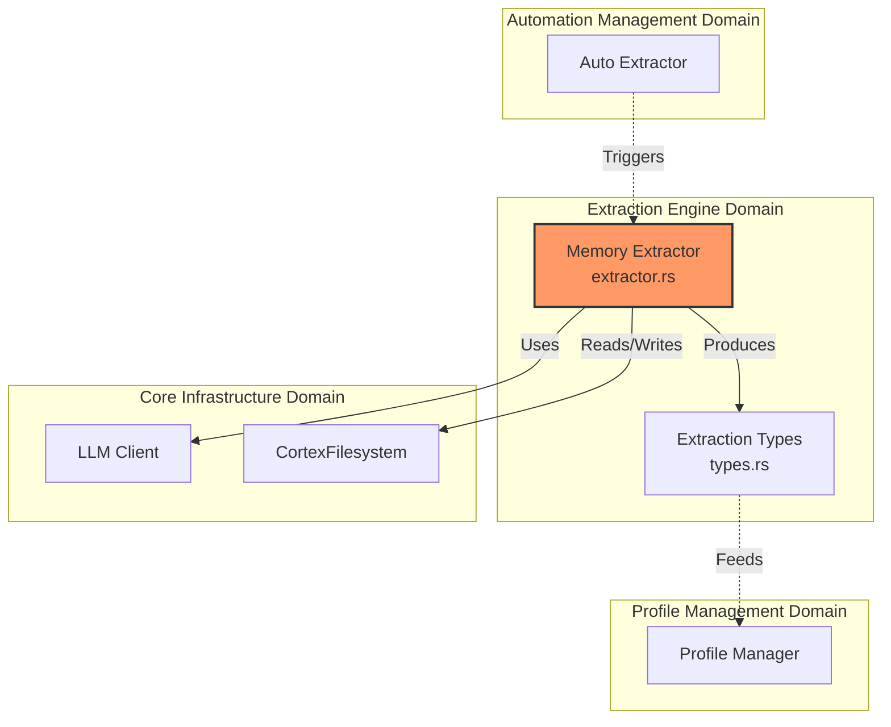
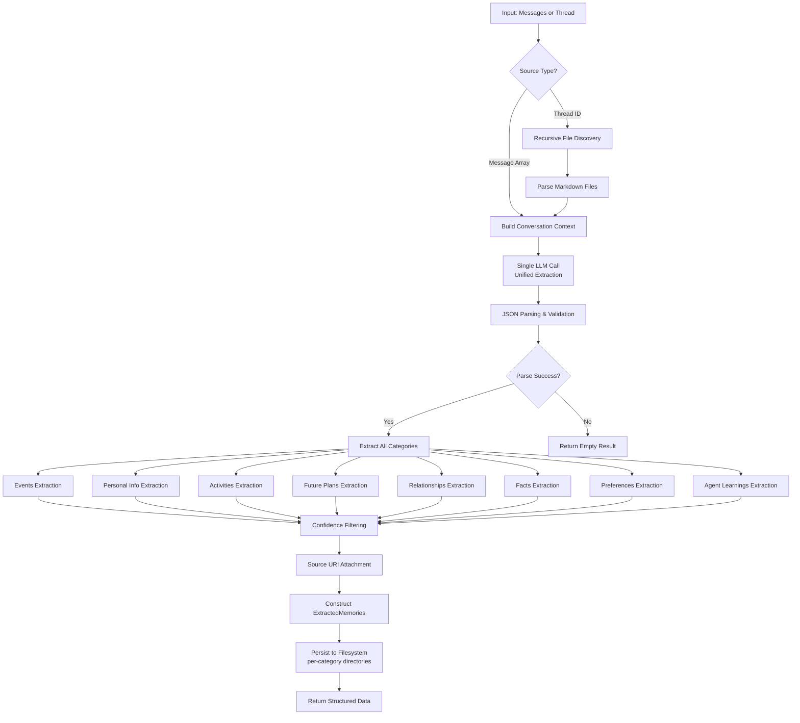
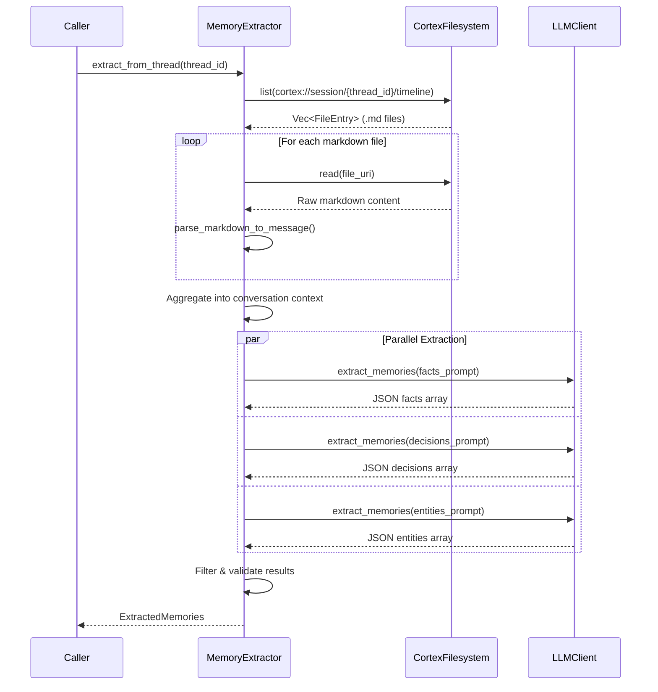

 **Extraction Engine Domain Technical Documentation**

**Generation Time:** 2026-03-30 (UTC)  
**Version:** 1.1.0  
**Domain Classification:** Core Business Domain  
**Complexity Score:** 8.0/10  
**Business Criticality:** 8.0/10  

---

## 1. Domain Overview

The **Extraction Engine Domain** is a specialized cognitive processing layer within Cortex-Mem responsible for transforming unstructured conversational data into structured, queryable knowledge representations. This domain implements intelligent Natural Language Processing (NLP) pipelines that identify, categorize, and extract semantic artifacts—specifically **events**, **personal info**, **activities**, **future plans**, **relationships**, and other memory types—from AI agent conversations.

### 1.1 Business Value Proposition

The domain addresses the fundamental challenge of knowledge persistence in AI systems by:

- **Semantic Structuring**: Converting free-form dialogue into typed knowledge objects with metadata
- **Temporal Awareness**: Extracting dated events with exact timestamps for temporal query support
- **Activity Tracking**: Identifying hobbies, sports, and interests for personalization
- **Attribution Preservation**: Maintaining provenance through source URI tracking, enabling auditability and context retrieval
- **Confidence Scoring**: Filtering low-quality extractions using configurable confidence thresholds (default: 0.6)
- **Cross-Session Learning**: Enabling persistent user and agent personalization through the Memory Extraction and Profiling Process

### 1.2 Architectural Position

Within the Cortex-Mem architecture, the Extraction Engine operates as a **Core Business Domain** encapsulated within `cortex-mem-core`. It serves as the primary bridge between raw conversational data (L2 Detail layer) and structured profile knowledge.



---

## 2. Core Components

### 2.1 Memory Extractor (`cortex-mem-core/src/extraction/extractor.rs`)

The **MemoryExtractor** is the primary orchestration component, implemented as a Rust struct with dependency injection for filesystem and LLM operations.

#### 2.1.1 Structural Definition

```rust
pub struct MemoryExtractor {
    fs: Arc<dyn CortexFilesystem>,
    llm: Arc<dyn LLMClient>,
    config: ExtractionConfig,
}
```

**Dependencies:**
- **CortexFilesystem**: Abstracts storage operations for reading conversation threads and persisting extraction results
- **LLMClient**: OpenAI-compatible interface for generative extraction operations
- **ExtractionConfig**: Feature flags controlling extraction types (facts, decisions, entities) and quality thresholds

#### 2.1.2 Public Interface

| Method | Signature | Purpose |
|--------|-----------|---------|
| `extract_from_messages` | `async fn(&self, thread_id: &str, messages: &[Message]) -> Result<ExtractedMemories>` | Direct extraction from in-memory message arrays |
| `extract_from_thread` | `async fn(&self, thread_id: &str) -> Result<ExtractedMemories>` | Recursive filesystem-based extraction from markdown timelines |
| `save_extraction` | `async fn(&self, thread_id: &str, extraction: &ExtractedMemories) -> Result<()>` | Persistence of extraction results to `cortex://session/{thread_id}/extractions/` |

### 2.2 Extraction Types (`cortex-mem-core/src/extraction/types.rs`)

Defines the domain model for structured memory artifacts with strong typing and serialization support.

#### 2.2.1 Core Data Structures

```rust
pub struct ExtractedMemories {
    pub events: Vec<ExtractedEvent>,
    pub personal_info: Vec<PersonalInfoMemory>,
    pub activities: Vec<ActivityMemory>,
    pub future_plans: Vec<FuturePlanMemory>,
    pub relationships: Vec<RelationshipMemory>,
    pub facts: Vec<ExtractedFact>,
    pub user_preferences: Vec<PreferenceMemory>,
    pub agent_learnings: Vec<AgentLearning>,
    pub source_thread_id: String,
    pub extracted_at: DateTime<Utc>,
}

pub struct ExtractedEvent {
    pub title: String,
    pub date: String,           // Exact date/time string
    pub description: String,
    pub participants: Vec<String>,
    pub event_type: String,     // meeting, trip, race, class, ceremony, etc.
}

pub struct PersonalInfoMemory {
    pub person: String,
    pub category: PersonalInfoCategory,  // career, relationship, identity, research, other
    pub content: String,
}

pub struct ActivityMemory {
    pub person: String,
    pub activity: String,
    pub context: String,        // "signed up", "participates in", "enjoys", etc.
}

pub struct FuturePlanMemory {
    pub person: String,
    pub event: String,
    pub date: String,
    pub description: String,
}

pub struct RelationshipMemory {
    pub persons: Vec<String>,
    pub relationship_type: String,
    pub description: String,
}

pub struct ExtractedFact {
    pub content: String,
    pub category: FactCategory,  // Personal, Professional, Preference, etc.
    pub confidence: f32,         // 0.0 - 1.0
    pub source_uris: Vec<String>,
    pub importance: i32,         // 1-10 scale
}
```

#### 2.2.2 Extraction Categories

| Category | Description | Example Content |
|----------|-------------|-----------------|
| **Events** | Dated occurrences with timestamps | Meetings, trips, classes, ceremonies |
| **Personal Info** | Identity facts about people | Career, job, research topics, background |
| **Activities** | Hobbies and interests | Pottery, camping, swimming, painting |
| **Future Plans** | Scheduled upcoming events | Conferences, appointments, planned activities |
| **Relationships** | Connections between people | Family, friends, colleagues, partners |
| **Facts** | Other factual information | General knowledge statements |
| **Preferences** | User likes/dislikes | Preferred tools, styles, approaches |
| **Agent Learnings** | Insights for future interactions | Successful approaches, task patterns |

---

## 3. Extraction Workflows

### 3.1 Primary Extraction Pipeline

The extraction engine implements a unified LLM call that extracts all memory types in a single pass:



### 3.2 Thread-Based Extraction Sequence

When operating on filesystem-based conversation threads, the extractor performs I/O operations before LLM processing:



### 3.3 Confidence Scoring & Quality Assurance

The domain implements a multi-layered quality control mechanism:

1. **LLM Confidence**: The underlying model provides confidence scores based on response probability
2. **Threshold Filtering**: Configurable `min_confidence` parameter (default: 0.6) filters uncertain extractions
3. **Structural Validation**: JSON schema validation ensures type safety before domain object construction
4. **Source Attribution**: Every extraction maintains reference to its origin URI(s) for traceability

---

## 4. Technical Implementation Details

### 4.1 Prompt Engineering Strategy

The extraction engine uses a **unified prompt** that extracts all memory categories in a single LLM call:

**Memory Extraction Prompt Categories**:

| Category | Focus | Example Extraction |
|----------|-------|-------------------|
| **Events** | Dated occurrences with exact timestamps | "July 2, 2023 - pottery class signup" |
| **Personal Info** | Career, job, research, background | "Caroline studies adoption agencies" |
| **Activities** | Hobbies, sports, interests | "Melanie enjoys pottery, camping, swimming" |
| **Future Plans** | Scheduled upcoming events | "Conference scheduled for July 2023" |
| **Relationships** | Connections between people | "Sarah is Melanie's close friend" |
| **Facts** | Other factual information | General knowledge statements |
| **Preferences** | User likes/dislikes | "Prefers dark mode" |
| **Agent Learnings** | Insights for future interactions | "Approach X was successful for task Y" |

**Output JSON Schema**:
```json
{
  "events": [{ "title": "...", "date": "...", "description": "...", "participants": [] }],
  "personal_info": [{ "person": "...", "category": "career|relationship|identity|research|other", "content": "..." }],
  "activities": [{ "person": "...", "activity": "...", "context": "signed up|participates in|enjoys|etc" }],
  "future_plans": [{ "person": "...", "event": "...", "date": "...", "description": "..." }],
  "relationships": [{ "persons": ["...", "..."], "type": "...", "description": "..." }],
  "facts": [{ "content": "...", "confidence": 0.9 }],
  "user_preferences": [{ "category": "...", "content": "..." }],
  "agent_learnings": [{ "task_type": "...", "learned_approach": "...", "success_rate": 0.8 }]
}
```

### 4.2 Overview Generation Prompt

The overview generation prompt now includes new structured sections:

**Overview Output Structure**:
- **Summary**: Brief overview of the content
- **Key Points**: 5-10 important takeaways
- **Entities**: Important people, organizations, technologies
- **Timeline Events**: ALL dated events with exact timestamps
- **Activities & Interests**: ALL activities, hobbies, sports mentioned
- **Context**: Background and situational information

### 4.3 Batch Processing & Performance

To optimize token usage and API costs:

- **Single-Pass Extraction**: All categories extracted in one LLM call (reduces API overhead)
- **Message Batching**: Processes up to 50 messages per LLM call to maximize context window utilization
- **Lazy Evaluation**: Only generates overviews when needed for search indexing

### 4.3 Error Handling & Resilience

The domain implements graceful degradation strategies:

```rust
// Fallback parsing for non-JSON LLM responses
fn parse_with_fallback(raw_response: &str) -> Result<ExtractedMemories, Error> {
    match serde_json::from_str(raw_response) {
        Ok(parsed) => Ok(parsed),
        Err(_) => parse_markdown_fallback(raw_response), // Regex-based extraction
    }
}
```

- **Partial Success**: If one extraction type fails (e.g., entities), facts and decisions are still returned
- **Filesystem Resilience**: Missing or corrupted message files are skipped with warning logs, not fatal errors

---

## 5. Integration Patterns

### 5.1 Automation Integration

The Extraction Engine is primarily consumed by the **Auto Extractor** (`automation/auto_extract.rs`) within the Automation Management Domain:


**Integration Point**: When a conversation session closes, the automation pipeline triggers `extract_from_thread()` to update user and agent profiles incrementally.

### 5.2 Profile Management Integration

Extracted memories flow into the Profile Management Domain through:

- **Fact Aggregation**: `UserProfile::add_fact()` merges new facts with deduplication logic
- **Decision History**: `AgentProfile::add_decision()` maintains agent learning history
- **Category Enforcement**: Profile managers enforce limits (e.g., max 100 facts per category) to prevent profile bloat

### 5.3 External API Surface

While primarily used internally, the extraction capabilities are exposed through:

- **MCP Tool**: `extract_memories` tool allows AI assistants to request on-demand extraction
- **HTTP API**: `/api/v2/sessions/{id}/extract` endpoint for manual extraction triggers
- **CLI Command**: `cortex-mem extract --thread <id>` for administrative operations

---

## 6. Configuration & Deployment

### 6.1 Configuration Schema

Extraction behavior is controlled via `ExtractionConfig`:

```toml
[extraction]
enabled = true
min_confidence = 0.6
extract_facts = true
extract_decisions = true
extract_entities = true
max_messages_per_batch = 50
```

### 6.2 Tenant Isolation

As part of the multi-tenant architecture:

- **Filesystem Scope**: Extractions are stored under `cortex://session/{thread_id}/extractions/` with tenant-specific resolution
- **Vector Store**: Extracted content destined for semantic search inherits tenant-aware collection naming (`cortex-mem-{tenant_id}`)
- **Profile Scope**: Merged profiles respect tenant boundaries, preventing cross-tenant knowledge leakage

---

## 7. Usage Examples

### 7.1 Direct Message Extraction

```rust
let extractor = MemoryExtractor::new(fs, llm, config);
let messages = vec![
    Message::new(Role::User, "I prefer Python over JavaScript"),
    Message::new(Role::Assistant, "Noted. I'll prioritize Python examples."),
];

let extracted = extractor.extract_from_messages("thread-123", &messages).await?;

for fact in extracted.facts {
    println!("Fact: {} (confidence: {})", fact.content, fact.confidence);
}
```

### 7.2 Thread-Based Extraction with Persistence

```rust
// Extract from filesystem thread
let memories = extractor.extract_from_thread("session-456").await?;

// Save to filesystem for audit trail
extractor.save_extraction("session-456", &memories).await?;

// Results stored at: cortex://session/session-456/extractions/{timestamp}.md
```

---

**Related Documentation:**
- [Automation Management Domain](./automation-management.md)
- [Profile Management Domain](./profile-management.md)
- [Session Management Domain](./session-management.md)
- [LLM Integration Guide](./llm-client.md)
