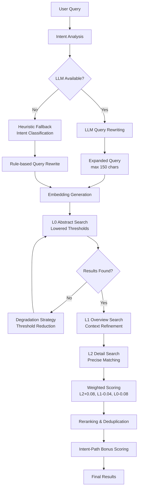

 **Technical Documentation: Search Engine Domain**

**Module:** `cortex-mem-core/src/search/vector_engine.rs`  
**Domain:** Core Business Domain  
**Version:** 1.1  
**Last Updated:** 2026-03-30 (UTC)

---

## 1. Executive Overview

The **Search Engine Domain** implements an intelligent, multi-layered semantic search system that enables context-aware memory retrieval across the Cortex-Mem platform. It serves as the primary retrieval mechanism for the AI agent memory system, supporting operations across all memory dimensions (user, agent, session, and resources).

### 1.1 Business Value
- **Precision Retrieval**: Delivers contextually relevant memories through hierarchical semantic analysis
- **Scalable Architecture**: Handles large memory corpora through progressive refinement (L0→L1→L2)
- **Adaptive Intelligence**: Dynamically adjusts search strategies based on query intent and result quality
- **Multi-Tenancy Support**: Enforces data isolation while maintaining search performance across tenants
- **Enhanced Recall**: Multi-path retrieval with heuristic fallback when LLM is unavailable

---

## 2. Architectural Design

### 2.1 High-Level Architecture

The Search Engine implements a **three-tier retrieval pattern** with weighted aggregation, enhanced by **multi-path retrieval** and **intelligent reranking**:



### 2.2 Core Components

| Component | Responsibility | Technology Stack |
|-----------|----------------|------------------|
| **Vector Search Engine** | Orchestrates layered retrieval and scoring | Rust, Async/Await, Tokio |
| **Embedding Client** | Generates dense vector representations | OpenAI-compatible APIs |
| **Qdrant Vector Store** | Persistence and similarity search | Qdrant (gRPC/HTTP) |
| **Intent Detector** | Classifies query types for adaptive thresholding | LLM + Heuristic fallback |
| **Query Rewriter** | Expands queries with synonyms and related terms | LLM / Rule-based |
| **Reranker** | Post-retrieval scoring adjustments | Keyword hits, URI path analysis |
| **Layer Manager** | Provides L0/L1 summary access | Filesystem + LLM caching |
| **Snippet Extractor** | Generates contextual text windows | String processing, Regex |

---

## 3. The Three-Layer Retrieval Model

The system implements a **progressive disclosure** pattern inspired by the TARS memory specification, searching across three abstraction levels:

### 3.1 Layer Definitions

| Layer | Content Type | File Suffix | Search Purpose | Weight |
|-------|--------------|-------------|----------------|--------|
| **L0 (Abstract)** | High-level summaries | `.abstract.md` | Broad semantic filtering | 20% |
| **L1 (Overview)** | Structured key points | `.overview.md` | Context refinement | 30% |
| **L2 (Detail)** | Raw conversation content | `.md` (full) | Precise semantic matching | 50% |

### 3.2 Hierarchical Search Strategy

**Phase 1: L0 Coarse Filtering**  
The engine first searches L0 abstracts using an adaptive similarity threshold (default 0.5). This layer acts as a coarse sieve, identifying candidate directories that broadly match the query semantics without expensive full-text processing.

**Phase 2: L1 Context Refinement**  
For directories with matching L0 content, the engine retrieves L1 overview vectors. This layer provides structured context (key topics, entities, decisions) that refines the initial candidate set.

**Phase 3: L2 Precise Matching**  
Within high-scoring candidate directories, the engine performs detailed semantic search against full message content. For timeline directories, this involves iterating through individual messages; for resource directories, direct content comparison.

**Phase 4: Weighted Aggregation**  
Final scores are computed using the weighted formula:
```
Combined Score = (0.2 × L0_Score) + (0.3 × L1_Score) + (0.5 × L2_Score)
```

---

## 4. Query Processing Pipeline

### 4.1 Intent Detection & Adaptive Thresholding

The engine classifies incoming queries into five intent categories to optimize retrieval parameters:

| Intent Type | Characteristics | Adaptive L0 Threshold | Use Case |
|-------------|----------------|----------------------|----------|
| **EntityLookup** | "Who is...", short names | 0.28 | Entity lookup, person identification |
| **Factual** | "What did X research", "What is X's job" | 0.32 | Personal fact queries |
| **Search** | "Find...", "What activities", "What hobbies" | 0.35 | Content discovery, list operations |
| **Temporal** | "When...", "Yesterday...", "What date" | 0.38 | Time-bound retrieval |
| **Relational** | "Relationship status", "How is X related to Y" | 0.35 | Connection analysis |
| **General** | Open-ended questions | 0.45 | Broad exploration |

**Implementation Note**: Thresholds have been lowered to improve recall for specific entity and fact queries. EntityLookup uses the lowest threshold (0.28) to ensure candidate coverage even when L0 summaries lack entity details.

### 4.2 Dual-Path Intent Analysis

The system implements a **fallback chain** for intent analysis:

#### 4.2.1 LLM-Based Intent Analysis (Primary)
When LLM is available and `enable_intent_analysis` is true:
- Single LLM call extracts: `rewritten_query`, `keywords`, `entities`, `intent_type`, `time_constraint`
- Query rewriting expands to max 150 characters with synonyms and related concepts
- Intent-specific expansion patterns (e.g., temporal queries add "timeline/event/date/time")

#### 4.2.2 Heuristic Fallback Intent Analysis
When LLM is unavailable, the engine uses rule-based classification:

```rust
fn fallback_intent(query: &str) -> EnhancedQueryIntent {
    let query_lower = query.to_lowercase();
    
    // Temporal detection
    if contains_any(&query_lower, &["when", "date", "time", "before", "after", 
                                      "昨天", "什么时候", "哪天"]) {
        QueryIntentType::Temporal
    }
    // Relational detection  
    else if contains_any(&query_lower, &["relationship", "friend", "partner", 
                                          "family", "support", "关系", "支持"]) {
        QueryIntentType::Relational
    }
    // Search/List detection
    else if contains_any(&query_lower, &["list", "find", "search", "show",
                                          "activities", "hobbies", "哪些", "列出"]) {
        QueryIntentType::Search
    }
    // Entity lookup detection
    else if contains_any(&query_lower, &["who is", "what is", "identity",
                                          "background", "是谁", "身份"]) {
        QueryIntentType::EntityLookup
    }
    else {
        QueryIntentType::Factual
    }
}
```

### 4.3 Query Rewriting Strategies

Query rewriting applies intent-specific expansion patterns:

| Intent Type | Expansion Terms |
|-------------|----------------|
| **EntityLookup** | + "identity", "background", "profile", "personal info" |
| **Factual** | + "fact", "details", "context" |
| **Temporal** | + "timeline", "event", "date", "time" |
| **Relational** | + "relationship", "friend", "support", "connection" |
| **Search** | + "search", "relevant", "memory" |

**Example**:
- Input: "When did pottery class"
- Rewritten: "When did pottery class date time event timeline timestamp when pottery class signup enrolled date schedule July"

### 4.3 Vector Generation

Query text is converted to dense embeddings using the configured embedding model (default: OpenAI-compatible APIs). The resulting vector serves as the search key for similarity computation across all layers.

---

## 5. Robustness: Degradation Strategies

The engine implements **graceful degradation** to ensure result delivery even when optimal conditions are not met:

### 5.1 Threshold Relaxation
If L0 search returns no results above the initial threshold:
1. **First Retry**: Reduce threshold 0.5 → 0.4
2. **Second Retry**: Reduce threshold 0.4 → 0.3
3. **Final Fallback**: Execute full semantic search across L2 layer (bypassing L0/L1 optimization)

### 5.2 Filesystem Fallback
For unindexed L2 content (vectors not yet generated), the engine falls back to filesystem reads:
- Reads raw markdown content from `cortex://` URIs
- Assigns L2 score of 0.0 (weighted contribution from L0/L1 only)
- Useful for real-time content not yet synchronized to vector store

---

## 6. Result Processing

### 6.1 Snippet Generation
For each qualifying result, the engine extracts contextual snippets:
- **Context Window**: 100 characters before/after match
- **Maximum Length**: 200 characters total
- **Highlighting**: Query term emphasis for UI presentation

### 6.2 Metadata Filtering
Results are post-filtered based on:
- **Tenant Isolation**: `tenant_id` strict matching
- **Temporal Bounds**: `created_at` range filtering
- **Entity Constraints**: Specific participant or dimension filtering
- **URI Prefix Scoping**: Limiting search to specific memory dimensions (user/agent/session)

### 6.3 Layer-Based Score Adjustment

After initial retrieval, scores are adjusted based on layer type:

| Layer | Score Adjustment | Rationale |
|-------|------------------|-----------|
| **L2 (Detail)** | +0.08 | Most precise content deserves boost |
| **L1 (Overview)** | -0.04 | Summaries may miss specifics |
| **L0 (Abstract)** | -0.08 | Coarse summaries need penalty |

### 6.4 Reranking Pipeline

The engine applies a multi-factor reranking algorithm to improve relevance:

```rust
fn rerank_results(results: &mut Vec<SearchResult>, intent: &EnhancedQueryIntent) {
    for result in results.iter_mut() {
        let uri_lower = result.uri.to_lowercase();
        let snippet_lower = result.snippet.to_lowercase();
        
        // Base adjustment for URI type
        let mut bonus = if is_leaf_uri(&result.uri) { 0.12 } else { -0.12 };
        if is_summary_uri(&result.uri) { bonus -= 0.12; }
        
        // Keyword and entity hit bonuses
        let keyword_hits = count_keyword_hits(&snippet_lower, &intent.keywords);
        let entity_hits = count_entity_hits(&snippet_lower, &intent.entities);
        bonus += keyword_hits.min(4.0) * 0.03;
        bonus += entity_hits.min(3.0) * 0.05;
        
        // Collection summary penalty
        bonus += collection_summary_penalty(&uri_lower);
        
        // Intent-specific path bonus
        bonus += intent_path_bonus(&intent.intent_type, &uri_lower);
        
        result.score += bonus;
    }
    
    results.sort_by(|a, b| b.score.partial_cmp(&a.score).unwrap());
}
```

### 6.5 Intent-Based Path Bonuses

Different intent types receive bonuses for specific URI paths:

| Intent Type | Path Pattern | Bonus |
|-------------|--------------|-------|
| **EntityLookup** | `/personal_info/` | +0.30 |
| **EntityLookup** | `/events/` | +0.12 |
| **EntityLookup** | `/entities/` | -0.14 |
| **Temporal** | `/events/` or `/timeline/` | +0.06 |
| **Relational** | `/relationships/` | +0.16 |
| **Search** | `/events/` | +0.12 |
| **Search** | `/preferences/` | +0.08 |

### 6.6 Deduplication

Results are deduplicated by canonical URI:

```rust
fn dedup_results(results: &mut Vec<SearchResult>) {
    let mut merged: HashMap<String, SearchResult> = HashMap::new();
    
    for result in results.drain(..) {
        let canonical_uri = canonicalize_uri(&result.uri);
        match merged.get_mut(&canonical_uri) {
            Some(existing) => {
                if result.score > existing.score {
                    *existing = result;
                }
            }
            None => { merged.insert(canonical_uri, result); }
        }
    }
    
    *results = merged.into_values().collect();
    results.sort_by(|a, b| b.score.partial_cmp(&a.score).unwrap());
}
```

**URI Canonicalization**:
- `.abstract.md` suffix → directory URI
- `.overview.md` suffix → directory URI
- Ensures same content doesn't appear multiple times

---

## 7. Integration Interfaces

### 7.1 Public API Surface

The module exposes two primary async interfaces:

```rust
// Direct semantic search (bypasses layered optimization)
pub async fn semantic_search(
    &self,
    query: &str,
    options: SearchOptions
) -> Result<Vec<SearchResult>, SearchError>

// Layered retrieval with intent detection and degradation
pub async fn layered_semantic_search(
    &self,
    query: &str,
    options: SearchOptions
) -> Result<Vec<SearchResult>, SearchError>
```

### 7.2 Dependency Injection

The engine maintains thread-safe references to external services via `Arc`:

```rust
pub struct VectorSearchEngine {
    vector_store: Arc<dyn QdrantVectorStore>,
    embedding_client: Arc<dyn EmbeddingClient>,
    filesystem: Arc<dyn CortexFilesystem>,
    llm_client: Option<Arc<dyn LLMClient>>, // Optional
}
```

### 7.3 Cross-Domain Interactions

| Target Domain | Interaction Pattern | Purpose |
|---------------|-------------------|---------|
| **Layer Management** | Service Call | Retrieve L0/L1 summaries |
| **Vector Storage** | Service Call | Execute similarity searches |
| **Core Infrastructure** | Composition | Access filesystem and embedding clients |
| **Automation Management** | Event Consumption | Re-index updated memories |

---

## 8. Configuration & Tuning

### 8.1 Search Parameters

| Parameter | Default | Description |
|-----------|---------|-------------|
| `limit` | 10 | Maximum results returned |
| `threshold` | Adaptive (0.4-0.5) | Minimum similarity score |
| `scope` | All dimensions | URI prefix filter (user/agent/session) |
| `include_content` | false | Return full text vs. snippets |

### 8.2 Performance Optimization

- **Batch Processing**: L2 searches within directories are batched to minimize vector store round-trips
- **Caching**: L0/L1 summaries are filesystem-cached to avoid repeated LLM generation
- **Tenant Isolation**: Collection suffixing (`cortex-mem-{tenant_id}`) ensures query-time filtering is unnecessary, improving performance

---

## 9. Implementation Details

### 9.1 Concurrency Model
- **Async/Await**: All I/O operations (vector search, filesystem, LLM) are non-blocking
- **Thread Safety**: Dependencies shared via `Arc`, preventing data races across concurrent search requests
- **Cancellation Safety**: Long-running searches respect Tokio cancellation tokens

### 9.2 Error Handling
- **Malformed URIs**: Graceful handling with warning logs
- **Missing Vectors**: Fallback to filesystem content
- **LLM Unavailability**: Degrades to original query (no rewriting)
- **Vector Store Timeout**: Retries with exponential backoff

### 9.3 Cosine Similarity
Similarity scores are computed using cosine distance between normalized vectors:
```
score = (query_vector · document_vector) / (||query|| × ||document||)
```

---

## 10. Usage Examples

### 10.1 Basic Search
```rust
let results = engine.layered_semantic_search(
    "machine learning project requirements",
    SearchOptions {
        limit: 5,
        threshold: 0.5,
        scope: Some("cortex://session/"),
        ..Default::default()
    }
).await?;
```

### 10.2 Factual Lookup (Lower Threshold)
```rust
let facts = engine.layered_semantic_search(
    "user's database password", // Factual intent detected
    SearchOptions {
        threshold: 0.4, // Automatically adjusted if intent detection enabled
        limit: 3,
        ..Default::default()
    }
).await?;
```

---

## 11. Monitoring & Observability

Key metrics to monitor:
- **Layer Hit Rates**: L0→L1→L2 progression ratios
- **Degradation Frequency**: How often fallback strategies trigger
- **Query Latency**: P99 percentiles for end-to-end search
- **Vector Store Latency**: Qdrant response times per layer

---

## 12. Summary

The Search Engine Domain represents a sophisticated **hierarchical retrieval system** that balances the precision of deep semantic search with the performance of coarse filtering. By leveraging the L0/L1/L2 abstraction architecture, it enables sub-second search across large memory corpora while maintaining the contextual richness required for AI agent operations.

The system's **adaptive thresholding** and **degradation strategies** ensure robustness across varying query types and system states, making it suitable for production deployments requiring high availability and consistent performance.

**Next Steps**: For integration details, refer to the [Session Management Domain] documentation for event flows, or the [Vector Storage Domain] documentation for underlying persistence mechanisms.
