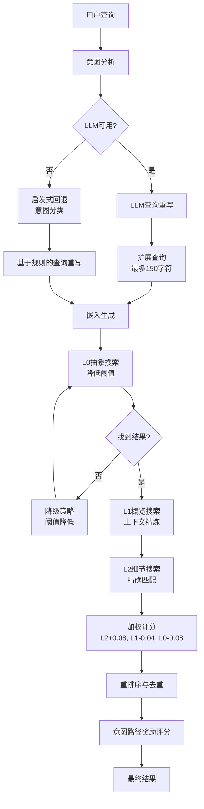

# 技术文档：搜索引擎领域

**模块:** `cortex-mem-core/src/search/vector_engine.rs`  
**领域:** 核心业务领域  
**版本:** 1.1  
**最后更新:** 2026-03-30 (UTC)

---

## 1. 执行概述

**搜索引擎领域**实现了一个智能的、多层语义搜索系统，支持跨Cortex-Mem平台的上下文感知记忆检索。它作为AI智能体记忆系统的主要检索机制，支持跨所有记忆维度（用户、智能体、会话和资源）的操作。

### 1.1 业务价值
- **精确检索**: 通过分层语义分析提供上下文相关的记忆
- **可扩展架构**: 通过渐进式精炼（L0→L1→L2）处理大型记忆语料库
- **自适应智能**: 根据查询意图和结果质量动态调整搜索策略
- **多租户支持**: 在跨租户保持搜索性能的同时强制执行数据隔离
- **增强召回**: 多路检索，LLM不可用时使用启发式回退

---

## 2. 架构设计

### 2.1 高级架构

搜索引擎实现**三层检索模式**，带加权聚合，并通过**多路检索**和**智能重排序**增强：



### 2.2 核心组件

| 组件 | 职责 | 技术栈 |
|-----------|------------------|------------------|
| **向量搜索引擎** | 编排分层检索和评分 | Rust, Async/Await, Tokio |
| **嵌入客户端** | 生成密集向量表示 | OpenAI兼容API |
| **Qdrant向量存储** | 持久化和相似性搜索 | Qdrant (gRPC/HTTP) |
| **意图检测器** | 分类查询类型用于自适应阈值 | LLM + 启发式回退 |
| **查询重写器** | 用同义词和相关术语扩展查询 | LLM / 基于规则 |
| **重排序器** | 检索后评分调整 | 关键词命中、URI路径分析 |
| **层级管理器** | 提供L0/L1摘要访问 | 文件系统 + LLM缓存 |
| **片段提取器** | 生成上下文文本窗口 | 字符串处理、正则 |

---

## 3. 三层检索模型

记忆规范启发的**渐进披露**模式，跨三个抽象层级搜索：

### 3.1 层级定义

| 层级 | 内容类型 | 文件后缀 | 搜索目的 | 权重 |
|-------|--------------|-------------|----------------|--------|
| **L0（抽象）** | 高级摘要 | `.abstract.md` | 宽泛语义过滤 | 20% |
| **L1（概览）** | 结构化关键点 | `.overview.md` | 上下文精炼 | 30% |
| **L2（细节）** | 原始对话内容 | `.md`（完整） | 精确语义匹配 | 50% |

### 3.2 分层搜索策略

**阶段1: L0粗过滤**  
引擎首先使用自适应相似度阈值（默认0.5）搜索L0抽象。该层作为粗筛，识别与查询语义广泛匹配的可能目录，无需昂贵全文处理。

**阶段2: L1上下文精炼**  
对于有匹配L0内容的目录，引擎检索L1概览向量。该层提供结构化上下文（关键主题、实体、决策）精炼初始候选集。

**阶段3: L2精确匹配**  
在高分候选目录内，引擎对完整消息内容执行详细语义搜索。对于时间线目录，这涉及迭代单个消息；对于资源目录，直接内容比较。

**阶段4: 加权聚合**  
最终评分使用加权公式计算：
```
组合评分 = (0.2 × L0_评分) + (0.3 × L1_评分) + (0.5 × L2_评分)
```

---

## 4. 查询处理管道

### 4.1 意图检测和自适应阈值

引擎将传入查询分类为六个意图类别以优化检索参数：

| 意图类型 | 特征 | 自适应L0阈值 | 用例 |
|-------------|----------------|-------------------|----------|
| **EntityLookup** | "谁是..."、短名称 | 0.28 | 实体查找、人物识别 |
| **事实(Factual)** | "X研究什么"、"X的工作是什么" | 0.32 | 个人事实查询 |
| **搜索(Search)** | "查找..."、"什么活动"、"什么爱好" | 0.35 | 内容发现、列表操作 |
| **时间(Temporal)** | "何时..."、"昨天..."、"什么日期" | 0.38 | 时间约束检索 |
| **关系(Relational)** | "关系状态"、"X与Y如何相关" | 0.35 | 连接分析 |
| **一般(General)** | 开放性问题 | 0.45 | 宽泛探索 |

**实现注意**: 阈值已降低以提高特定实体和事实查询的召回率。EntityLookup使用最低阈值（0.28）以确保候选覆盖，即使L0摘要缺少实体细节。

### 4.2 双路径意图分析

系统实现意图分析的**回退链**：

#### 4.2.1 基于LLM的意图分析（主要）
当LLM可用且`enable_intent_analysis`为true时：
- 单次LLM调用提取：`rewritten_query`、`keywords`、`entities`、`intent_type`、`time_constraint`
- 查询重写扩展到最多150字符，包含同义词和相关概念
- 意图特定扩展模式（如时间查询添加"timeline/event/date/time"）

#### 4.2.2 启发式回退意图分析
当LLM不可用时，引擎使用基于规则的分类：

```rust
fn fallback_intent(query: &str) -> EnhancedQueryIntent {
    let query_lower = query.to_lowercase();
    
    // 时间检测
    if contains_any(&query_lower, &["when", "date", "time", "before", "after", 
                                      "昨天", "什么时候", "哪天"]) {
        QueryIntentType::Temporal
    }
    // 关系检测  
    else if contains_any(&query_lower, &["relationship", "friend", "partner", 
                                          "family", "support", "关系", "支持"]) {
        QueryIntentType::Relational
    }
    // 搜索/列表检测
    else if contains_any(&query_lower, &["list", "find", "search", "show",
                                          "activities", "hobbies", "哪些", "列出"]) {
        QueryIntentType::Search
    }
    // 实体查找检测
    else if contains_any(&query_lower, &["who is", "what is", "identity",
                                          "background", "是谁", "身份"]) {
        QueryIntentType::EntityLookup
    }
    else {
        QueryIntentType::Factual
    }
}
```

### 4.3 查询重写策略

查询重写应用意图特定的扩展模式：

| 意图类型 | 扩展术语 |
|-------------|----------------|
| **EntityLookup** | + "identity", "background", "profile", "personal info" |
| **Factual** | + "fact", "details", "context" |
| **Temporal** | + "timeline", "event", "date", "time" |
| **Relational** | + "relationship", "friend", "support", "connection" |
| **Search** | + "search", "relevant", "memory" |

**示例**：
- 输入："When did pottery class"
- 重写："When did pottery class date time event timeline timestamp when pottery class signup enrolled date schedule July"

### 4.4 向量生成

查询文本使用配置的嵌入模型（默认：OpenAI兼容API）转换为密集嵌入。结果向量用作跨所有层相似度计算搜索键。

---

## 5. 健壮性：降级策略

引擎实现**优雅降级**以确保即使在非最佳条件也能交付结果：

### 5.1 阈值放松
如果L0搜索没有返回高于初始阈值的结果：
1. **首次重试**: 降低阈值0.5 → 0.4
2. **第二次重试**: 降低阈值0.4 → 0.3
3. **最终回退**: 跨L2层执行完整语义搜索（绕过L0/L1优化）

### 5.2 文件系统回退
对于未索引的L2内容（向量尚未生成），引擎回退到文件系统读取：
- 从`cortex://` URIs读取原始markdown内容
- 分配L2评分0.0（仅L0/L1加权贡献）
- 用于尚未同步到向量存储的实时内容

---

## 6. 结果处理

### 6.1 片段生成
对于每个合格结果，引擎提取上下文片段：
- **上下文窗口**: 匹配前后100个字符
- **最大长度**: 总共200个字符
- **高亮**: 查询词强调用于UI展示

### 6.2 元数据过滤
结果按以下条件后过滤：
- **租户隔离**: `tenant_id`严格匹配
- **时间范围**: `created_at`范围过滤
- **实体约束**: 特定参与者或维度过滤
- **URI前缀作用域**: 限制到特定记忆维度（用户/智能体/会话）的搜索

### 6.3 基于层级的评分调整

初始检索后，评分根据层级类型进行调整：

| 层级 | 评分调整 | 原因 |
|-------|------------------|---------|
| **L2（细节）** | +0.08 | 最精确的内容应获得提升 |
| **L1（概览）** | -0.04 | 摘要可能遗漏细节 |
| **L0（抽象）** | -0.08 | 粗粒度摘要需要惩罚 |

### 6.4 重排序管道

引擎应用多因素重排序算法以提高相关性：

```rust
fn rerank_results(results: &mut Vec<SearchResult>, intent: &EnhancedQueryIntent) {
    for result in results.iter_mut() {
        let uri_lower = result.uri.to_lowercase();
        let snippet_lower = result.snippet.to_lowercase();
        
        // URI类型的基础调整
        let mut bonus = if is_leaf_uri(&result.uri) { 0.12 } else { -0.12 };
        if is_summary_uri(&result.uri) { bonus -= 0.12; }
        
        // 关键词和实体命中奖励
        let keyword_hits = count_keyword_hits(&snippet_lower, &intent.keywords);
        let entity_hits = count_entity_hits(&snippet_lower, &intent.entities);
        bonus += keyword_hits.min(4.0) * 0.03;
        bonus += entity_hits.min(3.0) * 0.05;
        
        // 集合摘要惩罚
        bonus += collection_summary_penalty(&uri_lower);
        
        // 意图特定的路径奖励
        bonus += intent_path_bonus(&intent.intent_type, &uri_lower);
        
        result.score += bonus;
    }
    
    results.sort_by(|a, b| b.score.partial_cmp(&a.score).unwrap());
}
```

### 6.5 基于意图的路径奖励

不同意图类型对特定URI路径获得奖励：

| 意图类型 | 路径模式 | 奖励 |
|-------------|--------------|-------|
| **EntityLookup** | `/personal_info/` | +0.30 |
| **EntityLookup** | `/events/` | +0.12 |
| **EntityLookup** | `/entities/` | -0.14 |
| **Temporal** | `/events/` 或 `/timeline/` | +0.06 |
| **Relational** | `/relationships/` | +0.16 |
| **Search** | `/events/` | +0.12 |
| **Search** | `/preferences/` | +0.08 |

### 6.6 去重

结果按规范化URI去重：

```rust
fn dedup_results(results: &mut Vec<SearchResult>) {
    let mut merged: HashMap<String, SearchResult> = HashMap::new();
    
    for result in results.drain(..) {
        let canonical_uri = canonicalize_uri(&result.uri);
        match merged.get_mut(&canonical_uri) {
            Some(existing) => {
                if result.score > existing.score {
                    *existing = result;
                }
            }
            None => { merged.insert(canonical_uri, result); }
        }
    }
    
    *results = merged.into_values().collect();
    results.sort_by(|a, b| b.score.partial_cmp(&a.score).unwrap());
}
```

**URI规范化**：
- `.abstract.md` 后缀 → 目录URI
- `.overview.md` 后缀 → 目录URI
- 确保相同内容不会多次出现

---

## 7. 集成接口

### 7.1 公共API表面

该模块暴露两个主要异步接口：

```rust
// 直接语义搜索（绕过层优化）
pub async fn semantic_search(
    &self,
    query: &str,
    options: SearchOptions
) -> Result<Vec<SearchResult>, SearchError>

// 带意图检测和降级的分层检索
pub async fn layered_semantic_search(
    &self,
    query: &str,
    options: SearchOptions
) -> Result<Vec<SearchResult>, SearchError>
```

### 7.2 依赖注入

引擎通过`Arc`维护到外部服务的线程安全引用：

```rust
pub struct VectorSearchEngine {
    vector_store: Arc<dyn QdrantVectorStore>,
    embedding_client: Arc<dyn EmbeddingClient>,
    filesystem: Arc<dyn CortexFilesystem>,
    llm_client: Option<Arc<dyn LLMClient>>, // 可选
}
```

### 7.3 跨领域交互

| 目标领域 | 交互模式 | 目的 |
|---------------|-------------------|---------|
| **层级管理** | 服务调用 | 检索L0/L1摘要 |
| **向量存储** | 服务调用 | 执行相似性搜索 |
| **核心基础设施** | 组合 | 访问文件系统和嵌入客户端 |
| **自动化管理** | 事件消费 | 重新索引已更新记忆 |

---

## 8. 配置和调优

### 8.1 搜索参数

| 参数 | 默认 | 描述 |
|-----------|--------|-------------|
| `limit` | 10 | 返回的最大结果数 |
| `threshold` | 自适应(0.4-0.5) | 最小相似度评分 |
| `scope` | 所有维度 | URI前缀过滤器（用户/智能体/会话） |
| `include_content` | false | 返回全文vs片段 |

### 8.2 性能优化

- **批量处理**: 目录内L2搜索批量处理以最小化向量存储往返
- **缓存**: L0/L1摘要文件系统缓存以避免重复LLM生成
- **租户隔离**: 集合后缀（`cortex-mem-{tenant_id}`）确保查询时无需过滤，提高性能

---

## 9. 实现细节

### 9.1 并发模型
- **Async/Await**: 所有I/O操作（向量搜索、文件系统、LLM）非阻塞
- **线程安全**: 依赖通过`Arc`共享，防止跨并发搜索请求的数据竞争
- **取消安全**: 长搜索尊重Tokio取消令牌

### 9.2 错误处理
- **格式错误的URI**: 带警告日志的优雅处理
- **缺失向量**: 回退到文件系统内容
- **LLM不可用**: 降级到原始查询（无重写）
- **向量存储超时**: 指数退避重试

### 9.3 余弦相似度
相似度评分使用归一化向量之间的余弦距离计算：
```
评分 = (query_vector · document_vector) / (||query|| × ||document||)
```

---

## 10. 使用示例

### 10.1 基本搜索
```rust
let results = engine.layered_semantic_search(
    "machine learning project requirements",
    SearchOptions {
        limit: 5,
        threshold: 0.5,
        scope: Some("cortex://session/"),
        ..Default::default()
    }
).await?;
```

### 10.2 事实查找（更低阈值）
```rust
let facts = engine.layered_semantic_search(
    "user's database password", // 检测到事实意图
    SearchOptions {
        threshold: 0.4, // 如果启用意图检测则自动调整
        limit: 3,
        ..Default::default()
    }
).await?;
```

---

## 11. 监控和可观察性

要监控的关键指标：
- **层级命中率**: L0→L1→L2进程比率
- **降级频率**: 回退策略触发频率
- **查询延迟**: 端到端搜索的P99百分位
- **向量存储延迟**: 每层Qdrant响应时间

---

## 12. 总结

搜索引擎领域代表了一个复杂的**分层检索系统**，在深度语义搜索的精度与粗过滤的性能之间取得平衡。通过利用L0/L1/L2抽象架构，它实现跨大型记忆语料库的亚秒搜索，同时保持AI智能体操作所需的上下文丰富性。

系统的**自适应阈值**和**降级策略**确保跨不同查询类型和系统状态的健壮性，使其适合需要高可用性和一致性能的生产部署。

**后续步骤**: 集成详情请参阅[会话管理领域]文档了解事件流，或[向量存储领域]文档了解底层持久化机制。
